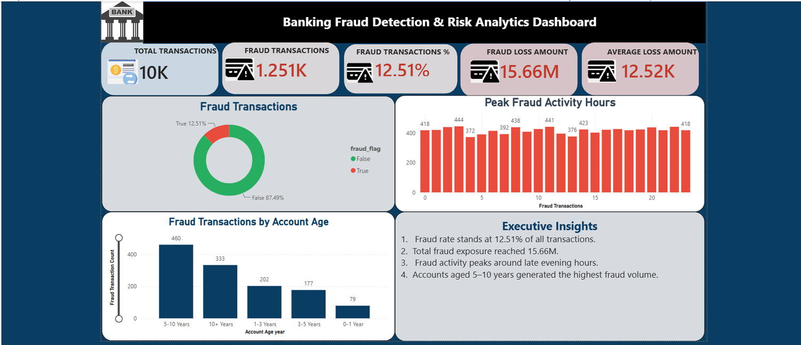

# Portfolio Website v2 — Setup & Deployment Guide

## What's in this folder

- `index.html` — home page: hero, trial-balance summary, about, skills, credentials, contact
- `projects.html` — dedicated projects page with all 5 projects
- `styles.css` — shared stylesheet (both pages need it — keep all files together)
- `photo.jpg` — your profile photo

## What changed from v1

- **Two pages now** — About/info page + dedicated Projects page, linked through the nav
- **Credentials updated to COMPLETED** — ICPAP Advanced Diploma + Post Graduate Diploma shown with a "KSA attested" badge (a real advantage for Saudi employers — keep those attested PDFs ready to show), FMVA certification (Jul 2026), BBA
- **Bank Fraud Detection is now a fully documented completed project** — described from your actual .pbix (3 report pages) and SQL file (15+ queries, DENSE_RANK, CASE risk tiers, fraud loss KPI)
- **New project added: Operating Expense Budgeting & Forecast Model** — from your Budgeting.xlsx (Best/Worst/Live scenario switching into an income statement forecast)
- **Colgate DCF + LBO** listed with a "Documentation pending" badge — will be finalized when you upload the model files
- Status badges on every project: Completed / In progress / Documentation pending
- Trial balance strip updated (4 qualifications completed, 15+ SQL queries line added)
- LinkedIn button now points to your real profile URL

## Before publishing — to-do list

1. **CV PDF**: export your latest CV as PDF named `Shahzaib_Ahmad_CV.pdf` into this folder (the Download CV button points to it).
2. **Project screenshots**: replace each dashed placeholder box. Open your .pbix files in Power BI Desktop, screenshot the best page of each, then swap:
   ```html
   <div class="proj-visual">[ Replace with ... ]</div>
   ```
   with:
   ```html
   
   ```
   Suggested files: `fraud_dashboard.png`, `meridian_dashboard.png`, `budgeting_model.png`.
3. **When your BBA degree/transcript and Colgate DCF/LBO files arrive**: send them over and I'll update the Colgate project entry (remove "Documentation pending") and anything else needed.

## Preview locally

Double-click `index.html`. All pages work offline — just keep the 4 files in one folder.

## Deploy free

**GitHub Pages:** create a repository named `yourusername.github.io`, upload ALL files (index.html, projects.html, styles.css, photo.jpg, CV PDF, screenshots), wait 1-2 minutes, live at `https://yourusername.github.io`.

**Netlify:** drag the whole folder onto netlify.com — instant URL.

## Optional upgrades later

- Custom domain (~$10/year)
- Add your capstone screenshots when it's finished (the badge flips from "In progress" to "Completed")
- Link each project card to a GitHub repo containing the SQL/model files
